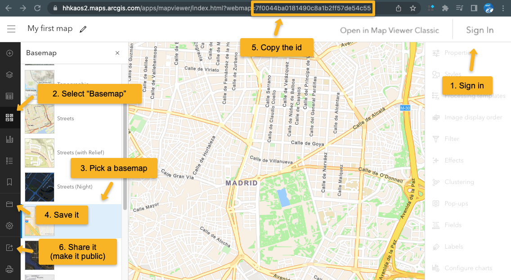
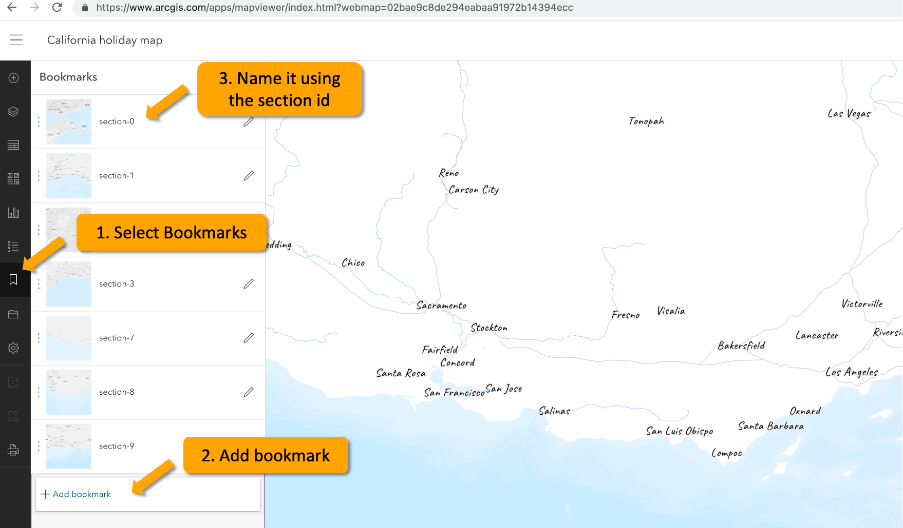

# Map your holiday - EuroCarto 2022 Workshop

## Workshop Prerequisites

- Node.js 16.0+ - [Installation](https://nodejs.org/en/)
- [VSCode](https://code.visualstudio.com/)
- git - [Installation](https://git-scm.com/book/en/v2/Getting-Started-Installing-Git) (optional, only if you want to publish your project on the web later on)

## Set up project locally

In the command line (tip - I use [Hyper](https://hyper.is/) and I love it):

If you installed git you can clone the project:

```
git clone git@github.com:RalucaNicola/workshop-holiday-map.git
```

If you didn't install git then you can download the repository on the [github website](https://github.com/RalucaNicola/workshop-holiday-map). [Here is a description](https://sites.northwestern.edu/researchcomputing/resources/downloading-from-github/) of how to do that. Unzip the folder.

Go to the newly created folder and install dependency libraries:

```
cd workshop-holiday-map
npm install
```

To start a local server with the project:

```
npm run dev
```

Then open your browser at http://localhost:3000/

## Discover the structure of the project

Take a look at the structure of [index.html](./index.html). The story map has:

- the intro page of the story. You can add the title of the story and a description with an intro image. You can change the styling in [general.scss](./src/general.scss).
- the content with different sections for each part of the story. The id of the section is important, we will link it with the geodata. The content can be text, video or images.
- at the end of the content there is a map panel. This has a fixed location at the bottom of the screen and scrolling through text is synchronized with what is being shown in the map.
- the closing page of the story (text and image)

## Set up the map

To create the map you'll need a free [ArcGIS Developer account](https://developers.arcgis.com/sign-up). Once you created it and confirmed your email address, you can use it to create a web map:

1. Go to the [ArcGIS Map Viewer](https://www.arcgis.com/apps/mapviewer/index.html) and login with the account you created.
1. Activate the "Basemap" selection tool.
1. Choose a basemap.
1. Save the web map.
1. Copy the ID.
1. Share it (Choose: "Everyone (public)").
1. Load it in the application using your ID.



Note: It's out of the scope of this workshop, but if you'd like to create a custom vector tile basemap, you can do it with the [Vector Tile Style Editor](https://developers.arcgis.com/vector-tile-style-editor/).

## Set up bookmarks

For a certain section of the storymap, you'll want to zoom to a location. We can achieve this by using bookmarks. In [ArcGIS Map Viewer](https://www.arcgis.com/apps/mapviewer/index.html) open the map you previously created and:

1. Go to Bookmarks.
1. Zoom and scroll on the map to go to the viewpoint you want to have in your section. Click to Add a new bookmark.
1. Name that bookmark using the section id.
1. Save the map



## Synchronizing the map and the text - how does it work

When the application loads, when the user scrolls or when the window is resized we calculate which section is currently visible. The id of the current visible section is used to either animate a path from [tracks.geojson](./public/data/tracks.geojson) (with the same id), to go to a map viewpoint or to filter the points in [points.geojson](./public/data/points.geojson).

## Create the data

I used [geojson.io](https://geojson.io/) to create the [point and line data](./public/data/) for this project. I animated the line data based on the scroll progress of a certain section and I filter the points based on the section they're supposed to be displayed in.

For example, the point that should be displayed in `"section-0"` will have a property `id` with the key `section-0`. The same for the tracks that will be animated. A polyline that should be animated in `"section-1"` will have a property `id` witht the key `section-1`. Have a look at the [data](./public/data/).

## Publish project to GitHub (optional)

Once you are happy with your map you can create a production build and deploy it to [GitHub Pages](https://pages.github.com/).

```
npm run build
```

The `dist` folder then contains all the files for the web app which can either be copied to a web server or pushed to the `gh-pages` branch to be served at `https://arnofiva.github.io/arcgis-core-template`.

In order to use the `gh-pages` approach, see the following instructions. Make sure you remove an existing `dist` folder if it has been created from a previous build.

## Deploy to [GitHub Pages](https://pages.github.com/)

### Create `gh-pages` branch

You can skip this part if you used the template by copying all branches, which includs the `gh-pages` branch that is part of this project.

If you only copied the `main` branch, follow these steps to create an orphan `gh-pages` branch (meaning it does not share any history with `main`):

```
rm -rf dist
git checkout --orphan gh-pages
git rm -rf .
git commit --allow-empty -m "Init empty branch"
git push origin gh-pages
```

Return to `main` branch:

```
git checkout main
```

### Checkout `gh-pages` branch in `dist/` folder

The following will create a `dist` folder (fails if it already exists) and make it point to the root of the `gh-pages` branch:

```
git worktree add dist gh-pages
```

### Deploy new version on `gh-pages` branch

Once the previous steps have been completed, you can repeat the following every time you want to deploy a new version of your local code:

```
npm run build
cd dist/
git add .
git commit -am '🎉'
git push origin gh-pages
cd ../
```
